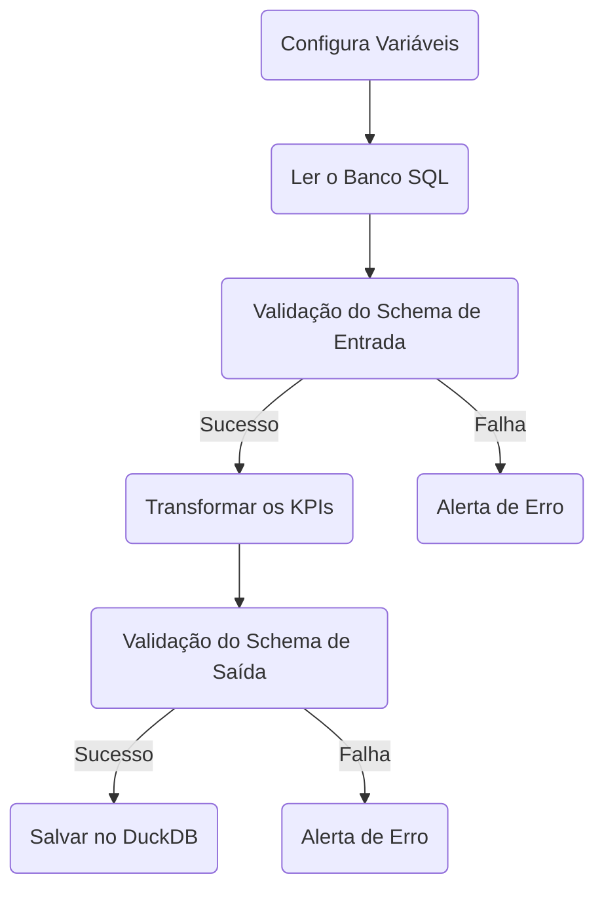

# Workshop 02 - Data Quality

Para desenvolver o desafio de negócio, vamos montar a seguinte ETL

## Fluxo

```mermaid
graph TD;
A(Configura Variáveis) --> B(Ler o Banco SQL)
B(Ler o Banco SQL) --> C(Validação do Schema de Entrada)
C(Validação do Schema de Entrada) --> |Sucesso| D(Transformar os KPIs)
C(Validação do Schema de Entrada) --> |Falha| E(Alerta de Erro)
D(Transformar os KPIs) --> F(Validação do Schema de Saída)
F(Validação do Schema de Saída) --> |Sucesso| G(Salvar no DuckDB)
F(Validação do Schema de Saída) --> |Falha| H(Alerta de Erro)
```

## Contrato de dados

::: app.schema.ProdutoSchema